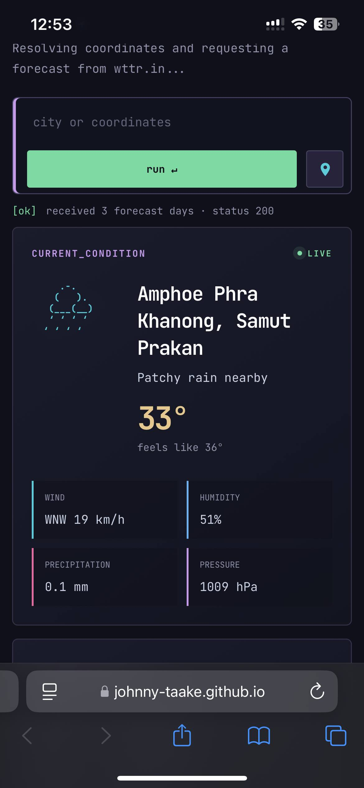
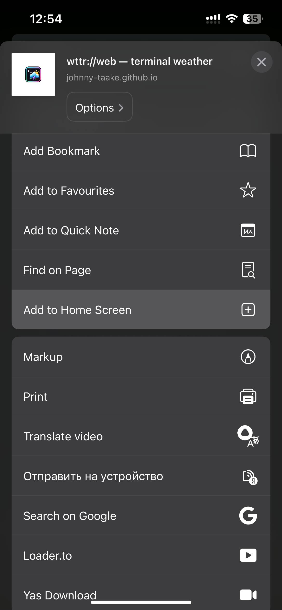

# [wttr://web](https://johnny-taake.github.io/WTTR-Web/)

  

  A terminal-style weather dashboard powered by <a href="https://wttr.in">wttr.in</a> and themed after the user's Kitty configuration.
   
  <em>Free for me, thanks to <a href="https://wttr.in">wttr.in</a> + <a href="https://pages.github.com/">GitHub Pages</a> — free for everyone.</em>
   
  <strong><a href="https://johnny-taake.github.io/WTTR-Web/">Open wttr://web ↗</a></strong>

## Add to your iPhone Home Screen

Open the site in Safari, tap the **Share** button, choose **Add to Home Screen**, and then tap **Add**. You can now launch `wttr://web` from its Home Screen icon like an app.

<table>
  <tr>
    <td align="center" width="50%">
      <strong>1. Open wttr://web in Safari</strong>  
      
    </td>
    <td align="center" width="50%">
      <strong>2. Tap Share, then Add to Home Screen</strong>  
      
    </td>
  </tr>
  <tr>
    <td align="center" width="50%">
      <strong>3. Confirm by tapping Add</strong>  
      
    </td>
    <td align="center" width="50%">
      <strong>4. Launch it from the Home Screen</strong>  
      
    </td>
  </tr>
</table>

## Features

- Browser geolocation weather
- Manual city or coordinate search
- Today, three-day, and hourly forecast views
- Rain, clear-weather, and wind filters
- Metric and imperial units
- Static, responsive terminal-style interface
- Automatic deployment to GitHub Pages

## Privacy & project promise

`wttr://web` is deliberately backendless: your browser sends forecast requests straight to [wttr.in](https://wttr.in). There is no project server receiving, proxying, storing, or selling your weather queries or coordinates.

- No accounts, cookies, analytics, telemetry, tracking pixels, or statistics collection
- No application server, database, API keys, Bootstrap, or third-party front-end dependencies
- No ads, paywalls, subscriptions, or commercial monetization — ever

A small, optional donation button may be added later. Donations will never unlock features or change the free experience.

## With thanks

<table>
  <tr>
    <td align="center" width="50%">
      
       
      <strong><a href="https://wttr.in">wttr.in</a></strong>
       
      Weather forecasts and the JSON data source.
        
      <a href="https://github.com/chubin/wttr.in">Official source &amp; documentation ↗</a>
    </td>
    <td align="center" width="50%">
      
       
      <strong><a href="https://pages.github.com/">GitHub Pages</a></strong>
       
      Static hosting directly from this repository.
        
      <a href="https://docs.github.com/en/pages/getting-started-with-github-pages/what-is-github-pages">Official documentation ↗</a>
    </td>
  </tr>
</table>

## GitHub Pages

1. Create a GitHub repository and push these files.
2. In `Settings → Pages → Build and deployment`, select `GitHub Actions`.
3. A push to `master` automatically runs `.github/workflows/deploy.yml`.
